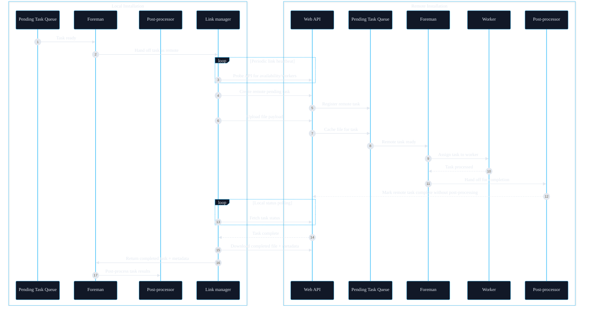
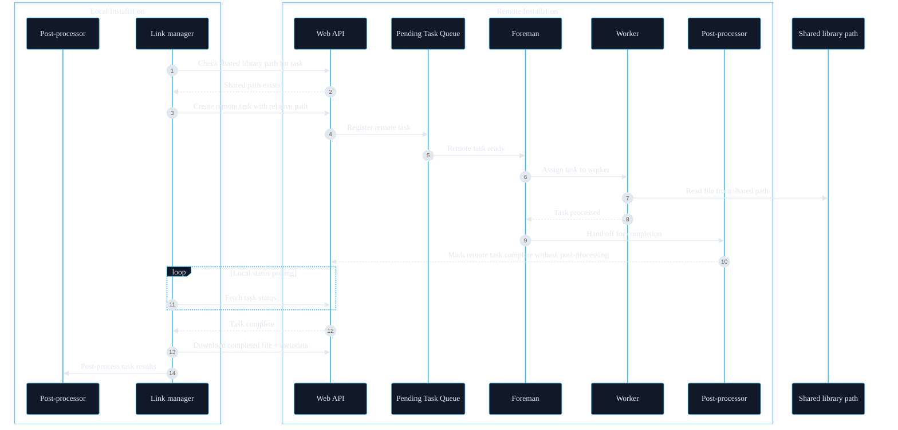

Linking lets multiple Unmanic installations cooperate so tasks can be processed across machines while keeping control in one place.

## How linking works

1. A local installation connects to one or more remote installations.
2. Tasks are queued on the local installation.
3. When a remote installation is available and configured to receive tasks, tasks are assigned to it.
4. The task is processed on the remote worker and results are returned to the local installation for post-processing.

## Remote Task flow diagram

## Shared library path behavior for Remote Task

If both installations can access the same files, the library paths must resolve to the same directory, even if the configured path strings are different on each machine. For example, a network share might be mounted as `/mnt/media/library` on the local host and `/media/library` on the remote host. In that case, each library points to its own local mount path, but both mounts reference the same underlying storage. When the matching file is reachable relative to the configured library path, the remote Unmanic installation reads it from the shared location instead of uploading the file through the API.

:::note
For remote tasks, the remote post-processor first tries to move the final cache file into a temporary directory alongside the original source path (on the shared library path) if it is writable. If that move fails, it falls back to keeping the file in the Unmanic cache, and the local installation downloads it over HTTP.

If the local installation only needs to move the processed file to replace the original, post-processing is faster.
:::
