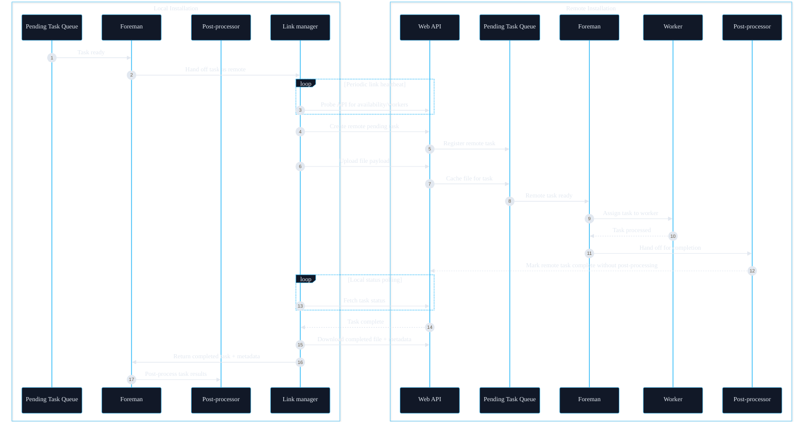
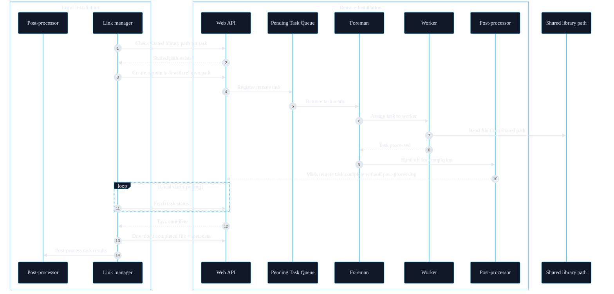

Linking lets multiple Unmanic installations cooperate so tasks can be processed across machines while keeping control in one place.

## How linking works

1. A local installation connects to one or more remote installations.
2. Tasks are queued on the local installation.
3. When a remote installation is available and configured to receive tasks, tasks are assigned to it.
4. The task is processed on the remote worker and results are returned to the local installation for post-processing.

## Remote Task flow diagram

## Shared library path behavior for Remote Task

If both installations can access the same files, the library paths must resolve to the same directory, even if the configured path strings are different on each machine. For example, a network share might be mounted as `/mnt/media/library` on the local host and `/media/library` on the remote host. In that case, each library points to its own local mount path, but both mounts reference the same underlying storage. When the matching file is reachable relative to the configured library path, the remote Unmanic installation reads it from the shared location instead of uploading the file through the API.

:::note
For remote tasks, the remote post-processor first tries to move the final cache file into a temporary directory alongside the original source path (on the shared library path) if it is writable. If that move fails, it falls back to keeping the file in the Unmanic cache, and the local installation downloads it over HTTP.

If the local installation only needs to move the processed file to replace the original, post-processing is faster.
:::

## Selective routing with matching library names

Linked task routing is based on library names and link configuration, not on worker capability tags across installations. A local installation will only send tasks to a linked remote installation when the link is enabled to receive tasks, the remote is reachable, and the remote has a library with the same name as the local task's library. Once the task arrives remotely, the remote installation applies its own library settings, tags, and plugins to process the task.

This means you can control where tasks go by selectively creating matching libraries on the installations that are capable of handling them. If a linked installation does not have a library with the same name, it will not receive tasks for that library. If you want tight control over which libraries appear remotely, disable the "Auto-configure missing libraries on the remote installation" option in the link configuration so libraries are only created when you explicitly configure them.

### How to think about it

- Routing decision: made by the local installation using link configuration and matching library names.
- Processing decision: made by the remote installation using its local library tags and plugin configuration.
- Worker tags: only filter workers locally on the installation that is processing the task.

### Recommended setup pattern

1. Pick a shared library name, for example `Media`.
2. Create the `Media` library on each installation you want to receive tasks for that library.
3. Configure plugins differently per installation based on hardware capability.
4. Leave the library absent on installations that should never receive that library's tasks.
5. Optionally use library and worker tags on each installation to route tasks within that installation.

### Detailed example: mixed GPU fleet

You have three linked installations with different accelerators:

- MacBook (M4): Hardware acceleration for Apple VideoToolbox.
- Server (NVIDIA): Transcoding with NVENC and NVDEC.
- NUC (Intel): Transcoding with Intel Quick Sync.

Use the same library name on each installation, for example `Media`, but configure the "Transcode Video" plugin differently on each:

- MacBook `Media` library: set the encoder and hardware options for VideoToolbox.
- Server `Media` library: set the encoder and hardware options for NVENC/NVDEC.
- NUC `Media` library: set the encoder and hardware options for Intel QSV.

With this setup, the local installation can send any `Media` tasks to any linked installation that has the `Media` library. Each remote installation will process the task using its own plugin settings, so the same library can be optimized for Apple, NVIDIA, or Intel hardware depending on where the task lands.

:::tip
You can still use "Automatically configure missing libraries on the remote installation" if you want a one-time push of the local library configuration to a new remote installation, then edit plugin settings independently on each install. That option only creates missing libraries and does not keep them in sync after the initial push. See [Remote Installation Configuration](./link_remote_configuration).
:::

:::warning
If "Automatically configure missing libraries on the remote installation" is enabled, every local library can be created remotely, which effectively allows tasks from all libraries to be sent to that installation. If you want to prevent certain libraries from ever sending tasks to a remote installation, turn this option off and create only the libraries you want on that remote.
:::

### Example flows

Example 1: Remote library exists

- Local `Media` library queues a task.
- Link manager sees that the remote installation is enabled to receive tasks and has a `Media` library.
- Task is sent to the remote installation.
- Remote installation applies its local `Media` library settings and plugin configuration.

Example 2: Remote library missing

- Local `Media` library queues a task.
- Link manager checks available remote installations.
- Remote installation does not have a `Media` library.
- Task is not sent to that remote installation.

Example 3: Auto-configure enabled

- Local `Media` library queues a task.
- Link manager sees auto-configure enabled and creates the missing `Media` library on the remote installation.
- The auto-configured library is set to receive remote-only tasks with scanning disabled, so no library path is configured.
- The task is sent and processed, and the transfer uses the HTTP upload/download flow instead of a shared library path.
- If you want shared library path behavior, then you would need to manually configure the remote library with the correct path.

Example 4: Different path strings, same shared storage

- Local `Media` library path is `/mnt/media/library`.
- Remote `Media` library path is `/media/library`.
- Both paths point to the same underlying storage (for example, the same network share mounted at different locations).
- The remote installation resolves the relative file path under its own library path, finds the file, and uses the shared library path flow without uploading over HTTP.

Example 5: Different storage, no shared path match

- Local `Media` library path is `/mnt/media/library`.
- Remote `Media` library path is `/media/library`, but it points to a different disk or share.
- The remote installation cannot find the file at the resolved path, so it falls back to the HTTP upload/download flow.

:::tip
For verbose logging, enable `EnableDebugging` on each installation under the Logs section of the Help & Support page. When debugging is enabled, you will see details about link availability, remote task creation, file transfers, and worker assignment in the logs. This is useful for confirming that libraries are matching as expected and that tasks are being processed with the correct plugin configuration on each machine.
:::
