Unmanic uses a plugin system to perform Unmanic's rich set of functions.
Plugins are stand-alone scripts or "modules" that are executed by Unmanic at defined stages during its task processing.

Usually, plugins are designed to carry out one function only.
However, in order to carry out that one function, some plugins are designed to be executed at multiple stages of task processing.

For example, you may install a plugin that will run during the library scan process to detect files that need to be added to the [pending tasks](/docs/dashboard/pending_tasks) queue due to an incorrect video codec.
When the [worker](/docs/dashboard/workers) picks up the task, it may execute that same plugin again which will now handle the job of transcoding the video streams to the configured codec.

In this example the plugin has carried out two separate jobs at different stages of Unmanic's task processing.

Use plugins to build powerful library optimisation flows.

---

## Plugin execution during Task flow

Sections in blue will execute plugins configured for that stage of the process.

```mermaid
%%{init: {"theme":"base","themeVariables":{
  "fontFamily":"system-ui, -apple-system, Segoe UI, sans-serif",
  "primaryColor":"#0f172a",
  "primaryTextColor":"#e2e8f0",
  "primaryBorderColor":"#38bdf8",
  "lineColor":"#94a3b8",
  "tertiaryColor":"#111827",
  "tertiaryBorderColor":"#475569",
  "secondaryColor":"#1f2937",
  "secondaryBorderColor":"#f59e0b",
  "noteBkgColor":"#0f172a",
  "noteBorderColor":"#38bdf8"
}}}%%
flowchart TD
  classDef plugin fill:#0b2536,stroke:#38bdf8,stroke-width:1.5px,color:#e2e8f0;
  classDef io fill:#111827,stroke:#475569,stroke-width:1px,color:#e2e8f0;
  classDef warn fill:#2a1f0a,stroke:#f59e0b,stroke-width:1px,color:#fef3c7;

  st([Start]):::io
  discoverFile[File discovered by Library Scanner or Event Monitor]:::io
  libraryTestFileStart[Library Manager collects plugins for file testing]:::io
  libraryTestFileExecPlugin[Library file test<br/>plugin execution]:::plugin
  libraryTestPluginRequestIgnoreFile{Plugin requests ignore?}
  libraryTestPluginRequestTaskCreate{Plugin requests task?}
  libraryTestFileTaskCheckLoop{All library plugins executed?}
  fileNotAdded[File not added to pending tasks]:::warn
  pendingTasks[Added to pending tasks list]:::io
  workerCollects[Worker picks up task]:::io
  workerProcessTaskStart[Worker collects processing plugins]:::io
  workerExecPlugin[Worker executes processing plugin]:::plugin
  workerExecPluginCheck{Plugin executed OK?}
  workerExecPluginRequestCommand{Plugin requests command?}
  workerExecCommand[Worker executes command]:::io
  workerExecCommandCheck{Command executed OK?}
  workerProcessTaskCheckLoop{All worker plugins executed?}
  workerCompletesTask[Worker finishes task<br/>and hands to post-processor]:::io
  postProcessorFileMoveTaskStart[Post-processor collects file-move plugins]:::io
  postProcessorFileMoveExecPlugin[Post-processor executes file-move plugin]:::plugin
  postProcessorFileMoveTaskCheckLoop{All file-move plugins executed?}
  postProcessorTaskSuccessTaskStart[Post-processor collects result plugins]:::io
  postProcessorTaskSuccessExecPlugin[Post-processor executes result plugin]:::plugin
  postProcessorTaskSuccessTaskCheckLoop{All result plugins executed?}
  taskSuccess{All jobs successful?}
  completedTasksFailed[Task saved as failure]:::warn
  completedTasksSuccess[Task saved as success]:::io
  eIgnored([End - File ignored]):::io
  eFailed([End - Task failed]):::warn
  eSuccess([End - Task complete]):::io

  st-->discoverFile-->libraryTestFileStart
  libraryTestFileStart-->libraryTestFileExecPlugin-->libraryTestPluginRequestIgnoreFile
  libraryTestPluginRequestIgnoreFile-- yes -->fileNotAdded-->eIgnored
  libraryTestPluginRequestIgnoreFile-- no -->libraryTestPluginRequestTaskCreate
  libraryTestPluginRequestTaskCreate-- yes -->pendingTasks
  libraryTestPluginRequestTaskCreate-- no -->libraryTestFileTaskCheckLoop
  libraryTestFileTaskCheckLoop-- no -->libraryTestFileExecPlugin
  libraryTestFileTaskCheckLoop-- yes -->fileNotAdded
  pendingTasks-->workerCollects-->workerProcessTaskStart
  workerProcessTaskStart-->workerExecPlugin-->workerExecPluginCheck
  workerExecPluginCheck-- no -->workerCompletesTask
  workerExecPluginCheck-- yes -->workerExecPluginRequestCommand
  workerExecPluginRequestCommand-- yes -->workerExecCommand
  workerExecPluginRequestCommand-- no -->workerProcessTaskCheckLoop
  workerExecCommand-->workerExecCommandCheck
  workerExecCommandCheck-- no -->workerCompletesTask
  workerExecCommandCheck-- yes -->workerProcessTaskCheckLoop
  workerProcessTaskCheckLoop-- no -->workerExecPlugin
  workerProcessTaskCheckLoop-- yes -->workerCompletesTask
  workerCompletesTask-->postProcessorFileMoveTaskStart-->postProcessorFileMoveExecPlugin-->postProcessorFileMoveTaskCheckLoop
  postProcessorFileMoveTaskCheckLoop-- no -->postProcessorFileMoveExecPlugin
  postProcessorFileMoveTaskCheckLoop-- yes -->postProcessorTaskSuccessTaskStart
  postProcessorTaskSuccessTaskStart-->postProcessorTaskSuccessExecPlugin-->postProcessorTaskSuccessTaskCheckLoop
  postProcessorTaskSuccessTaskCheckLoop-- no -->postProcessorTaskSuccessExecPlugin
  postProcessorTaskSuccessTaskCheckLoop-- yes -->taskSuccess
  taskSuccess-- yes -->completedTasksSuccess-->eSuccess
  taskSuccess-- no -->completedTasksFailed-->eFailed
```

